<h3><b>¡Bienvenid@s al repositorio del grupo 95 del cohorte 16 de data-bi de No Country! </b></h3>
 

<h1><b>👨‍🍳 DataChef: Optimización Gastronómica</b></h1>

 

 

En un mercado gastronómico cada vez más competitivo, el éxito de un restaurante se sustenta en la eficiencia y la rentabilidad. La intuición y la experiencia tradicionales ya no bastan en este entorno. Para destacarse, los restaurantes deben valerse de herramientas que les permitan tomar decisiones estratégicas respaldadas por datos concretos. El análisis de datos y la implementación de modelos predictivos se vuelven imprescindibles en este contexto. Estas tecnologías innovadoras ofrecen una perspectiva hacia el futuro al proporcionar información valiosa sobre el comportamiento de los clientes, las tendencias del mercado y el rendimiento del negocio. El propósito de este proyecto de análisis de datos es aprovechar estas tecnologías para optimizar las operaciones y estrategias de ventas del restaurante, aumentando su eficiencia y rentabilidad. A través de un minucioso análisis de los datos disponibles, se identificarán áreas de mejora, se desarrollarán modelos predictivos para la demanda y la toma de decisiones, y se personalizará la experiencia del cliente.

 

****
 
<h3 align="center">🛠️ Miembros del Equipo</h3>

****
 

 
 
|Participantes|Roles|Redes|
|:---:|:---:|:---:|
|**Franco Arce**|    |     |
|**Leopoldo Flores**||  |
|**Matias Ferreyra**||  |
|**Adriana Muñoz**|   |  |
|**Rodrigo Valdez**|   |  |
|**Julio Dip**||  |
|**Matias Ibarra**|      |  |
|**Maria Celeste Coronel**||  |

 

<h2>🚧 Stack de Tecnologías </h2>

<h2>🚩 User Stories:</h2>
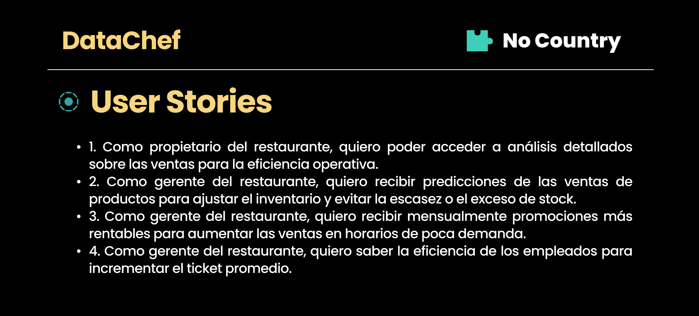

<h2>🚧 Producto mínimo viable (MVP):</h2>
 
Nuestro objetivo con este gestor es brindar a los propietarios y gerentes de restaurantes una herramienta poderosa y eficiente para optimizar sus operaciones diarias. Al tener acceso a información detallada sobre las ventas, pueden identificar tendencias, ajustar su inventario, mejorar la eficiencia en el servicio y brindar una experiencia aún mejor a sus clientes. Las predicciones de ventas les permiten planificar con anticipación y estar preparados para satisfacer la demanda de manera efectiva. En resumen, nuestro MVP está diseñado para ser una herramienta integral que ayude a los restaurantes a crecer y prosperar en un mercado competitivo.
 

<h2>🚧 Dashboard Interactivo Power BI</h2>
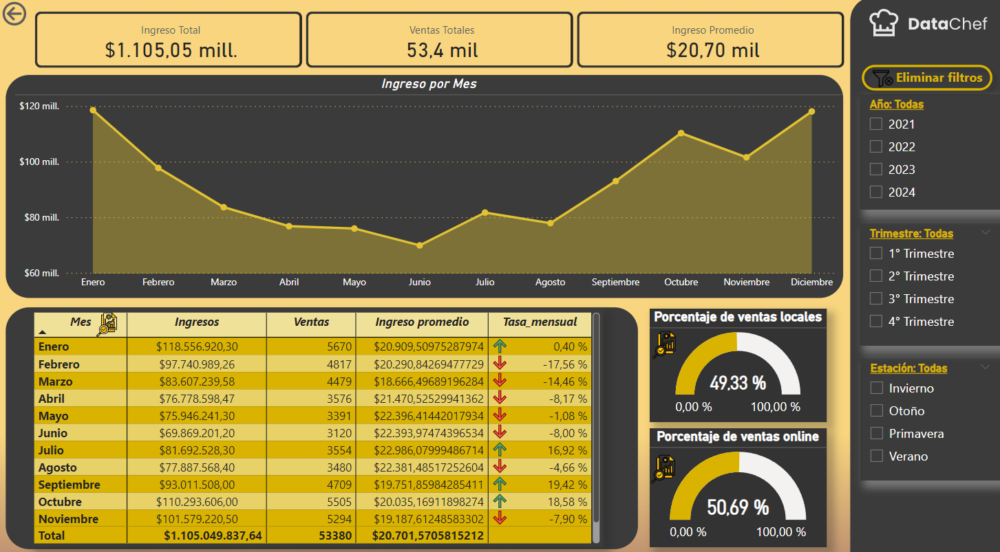
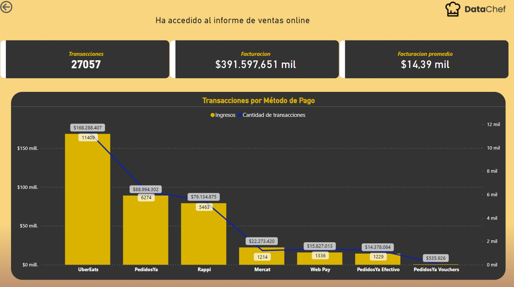
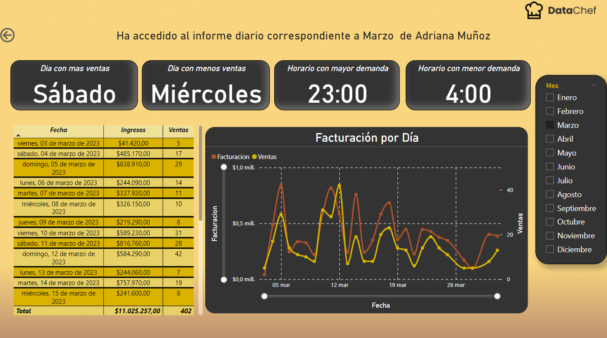
<h2>🚧 Etapas del Proyecto</h2>
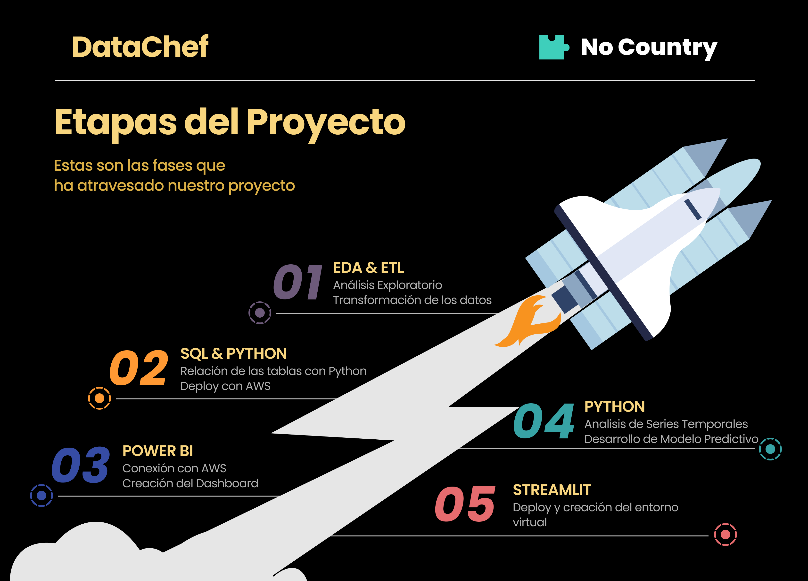
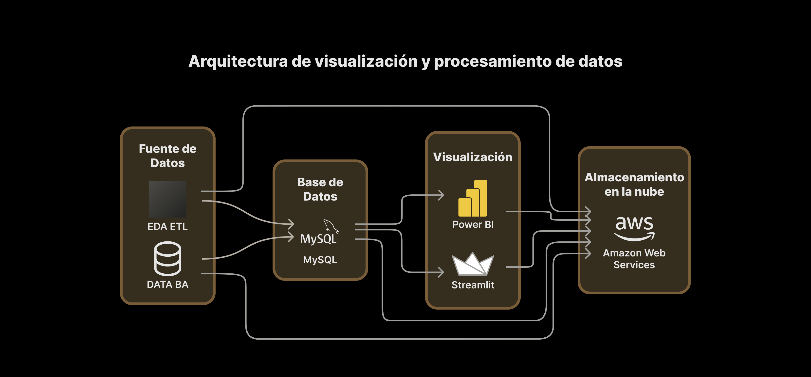
<h2>🚧 Conclusiones</h2>
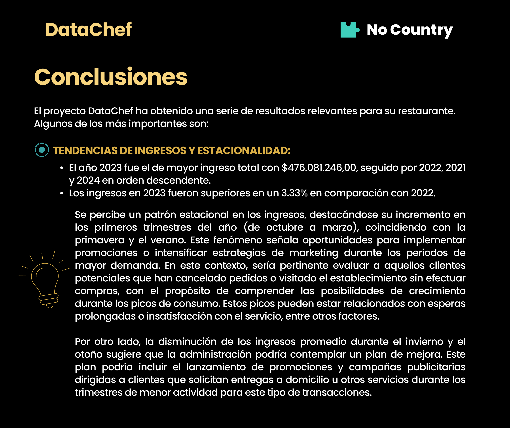
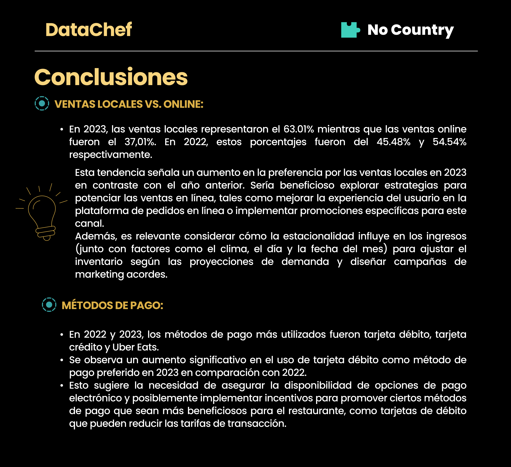
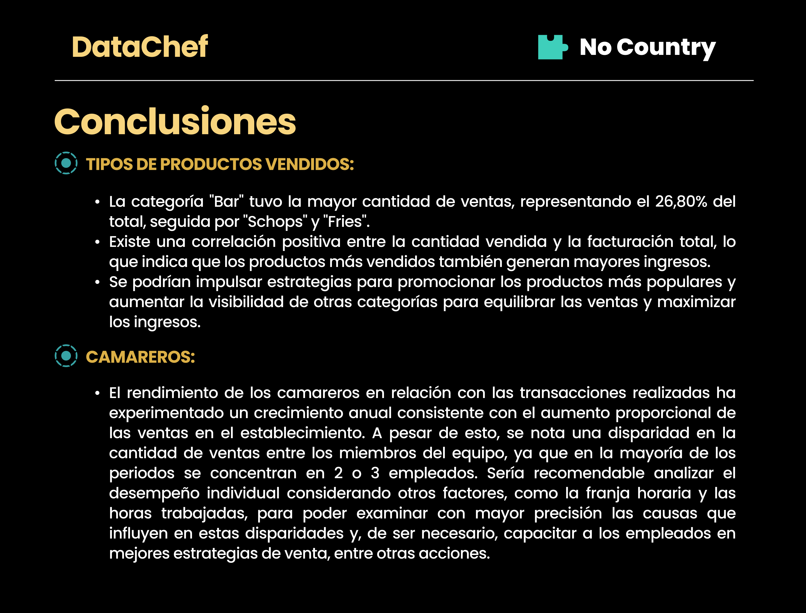

****
 

  

****
<h1 align='center' >Memoria del Proyecto</h1>

<h2 align='center' >✅ Sprint 0 ✅ </h2>
<h3>🚩 Creación del canal de Discord:</h3>

En el grupo de Slack se ha propuesto utilizar Discord como nuestra principal herramienta de comunicación. Esta decisión se basa en las siguientes ventajas que ofrece Discord:

<li>Compartir pantalla: ideal para colaborar en tareas que requieren visualización y edición conjunta de contenido. </li>
<li>Canales: facilita la organización y seguimiento de conversaciones temáticas, evitando la saturación en un único canal. </li>
<li>Familiaridad: la mayoría de nosotros ya conoce Discord, lo que facilita la adopción de la nueva plataforma. </li>

 
<h3>🚩 Organización de canales y salas de reuniones:</h3>

Para aprovechar al máximo las funcionalidades de Discord, se propone la siguiente estructura:

 
<h3>🚩 Primeras reuniones para conocernos.</h3>
A través de Discord, coordinamos un horario conveniente para nuestra primera reunión. Durante este encuentro, nos presentamos, compartimos nuestras experiencias previas, y definimos los horarios y roles correspondientes.
 
<h3>🚩 Definición de horario de reuniones diarias.</h3>
Hemos acordado que la reunión diaria se llevará a cabo todos los días a las 9:00 a.m., hora de Argentina, excepto los lunes y jueves, cuando nos reuniremos después de la reunión con el líder de equipo a las 9:30 a.m.
Durante estas reuniones diarias, cada miembro del equipo tendrá la oportunidad de compartir actualizaciones sobre su progreso, discutir posibles obstáculos y colaborar en soluciones. Se destacó la importancia de que todos participemos activamente y que mantengamos una actitud abierta y receptiva hacia las ideas de los demás.
 
<h3>🚩 Primeras ideas sobre proyectos.</h3>

En un principio, se consideraron diversas opciones; sin embargo, la decisión unánime fue la creación de un sistema de gestión para restaurantes basado en datos reales provenientes de un establecimiento donde trabaja una de las integrantes del equipo. Esta elección se fundamentó no solo en el potencial identificado en dichos datos, sino también en la oportunidad de abordar un caso práctico, lo que plantea un desafío significativo.

<h2 align='center' >✅ Sprint 1 ✅ </h2>

 
<h3>🚩 Elección del proyecto</h3>
Después de haber establecido el proyecto durante el Sprint 0, el equipo se reunió para discutir varios aspectos, incluyendo el alcance, los objetivos, los requisitos y las metodologías. Tras esta revisión, comenzaron a trabajar en el proyecto. Durante las primeras semanas, se enfocaron en la planificación detallada de las tareas, asignando responsabilidades y estableciendo un cronograma claro. El equipo se comprometió a mantener una comunicación abierta y constante para garantizar un flujo de trabajo eficiente y colaborativo. A medida que avanzaban, surgieron desafíos que abordaron con creatividad y trabajo en equipo, demostrando su compromiso con el éxito del proyecto.
 
<h3>🚩 Definir User Stories:</h3>

1. Como propietario del restaurante, quiero poder acceder a análisis detallados sobre las ventas para la eficiencia operativa.
2. Como gerente del restaurante, quiero recibir predicciones de las ventas de productos para ajustar el inventario y evitar la escasez o el exceso de stock.
3. Como gerente del restaurante, quiero recibir mensualmente promociones más rentables para aumentar las ventas en horarios de poca demanda.
4. Como gerente del restaurante, quiero saber la eficiencia de los empleados para incrementar el ticket promedio.
 
<h3>🚩 Primera extracción y limpieza de datos:</h3>
Obtenemos los datos con los que el restaurante cuenta actualmente, a través de la API con la que el local trabaja.
Podemos ver la estructura que tenian en ese momento:

En el archivo [conexión_api](./base_de_datos/conexion_api.ipynb) se puede ver todo el proceso de extracción y limpieza.
 
<h3>🚩 Creación de tablas y relaciones:</h3>
Mediante cambios en la estructura de los datos, se definieron distintas tablas en las que dividimos los registros, para su escalabilidad. De esta manera la base de datos no solo es más eficiente y optimiza el rendimiento, sino que permite hacer análisis más detallados de algunos puntos importantes, como las ventas por productos.

En el archivo [conexión_bbdd](./base_de_datos/conexion_bbdd.ipynb) se puede ver también cómo se crean las diferentes tablas y sus relaciones.
 
<h3>🚩 Creación de la base de datos en AWS</h3>
Tras evaluar diversas plataformas disponibles en el mercado para almacenar nuestros datos en la nube, se optó por Amazon Web Services debido a la amplia gama de recursos que proporciona.
Entre las ventajas que ofrece Amazon Web Services se encuentran su alta fiabilidad, escalabilidad y seguridad en el almacenamiento de datos. Además, su facilidad de uso y la posibilidad de personalizar los servicios según las necesidades específicas de nuestra empresa fueron aspectos determinantes en la elección de esta plataforma. 

Con AWS, tenemos la confianza de que nuestros datos estarán seguros y accesibles en todo momento, lo que nos permite enfocarnos en nuestro trabajo sin preocuparnos por la gestión de la infraestructura de almacenamiento.

En el archivo [conexión_bbdd](./base_de_datos/conexion_bbdd.ipynb) se puede ver también cómo se crean las diferentes tablas y sus relaciones.
 
<h3>🚩 Conexión de la base de datos a Power BI y primeros análisis</h3>

Una vez que se implementó la base de datos en la nube, el equipo de análisis logró establecer la conexión con éxito, lo cual les brindó acceso a los datos necesarios para su análisis. A partir de esta información, se crearon las primeras visualizaciones en Power BI:

Tambien se organizaron los Insights a desarrollar, cada uno posee descripcion de los resultados que se esperan obtener, lo que permite una mejor comprensión de la información.

Los mismos estan detallados en el <a href="https://trello.com/b/KMEuOzVb/analistas-de-datos"><b>Trello</b></a> en el que ha trabajado el Equipo de Analistas de Datos.

 
<h3>🚩 Creación de Landing Page</h3>
El equipo de Análisis se comprometió a crear una página web impactante que presentara el Producto Mínimo Viable (MVP) de forma clara y atractiva. Además, se incluirá información detallada sobre el objetivo del proyecto, el stack tecnológico utilizado y el equipo que hizo posible su desarrollo.
 
Para llevar a cabo este proyecto, el equipo de Análisis utilizará la herramienta Figma para diseñar la Landing Page de manera profesional y efectiva. La construcción de la página se realizará en React, aprovechando las ventajas que ofrece esta tecnología. Para darle un toque visual único, se emplearán librerías como Tailwind CSS para el estilizado, Swipper para crear una galería de imágenes dinámica y atractiva, y React Router para gestionar el redireccionamiento de manera eficiente.

<h2 align='center' >✅ Sprint 2 ✅ </h2>
 
<h3>🚩 Actualización de Forma de Pago</h3>

El equipo de Ingeniería de Datos solicitó la modificación de los métodos de pago debido a la presencia de "UberEats" y "Uber eats" en los registros, lo cual generaba una inconsistencia en la base de datos al referirse a la misma plataforma de forma dispar. Para abordar esta situación:

<li>Se realizo una consulta a toda la base de datos para reunir todos los registros con el método de pago <b>"Uber eats"</b></li>
<li>Se procedió a actualizar el campo de payment_id a <b>"5012" </b>(correspondiente a "UberEats") en dichos registros.</li>
<li>Por ultimo se elimina de la tabla de Metodos de Pago a <b>"Uber eats"</b> cuyo id era <b>50004</b></li>

 Se realizaron estos ajustes para garantizar la coherencia y precisión de la base de datos en relación a los métodos de pago de "Uber Eats". Estas medidas contribuirán a una mejor organización de la información y a evitar posibles errores futuros.

 Para ver mas en detalle como se realizo este trabajo le recomendamos ver el <a href="/base_de_datos/cambio_formadepagouber.ipynb"><b>archivo</b></a> que contiene el proceso.

 
<h3>🚩 Actualización de Productos</h3>

Al momento de analizar los productos ofrecidos por el restaurante nos encontramos con que había inconsistencias en la base de datos, estas eran: 
<li>Nombres de productos repetidos para productos que correspondían a diferentes métodos de compra (en el Local, en UberEats, en Rappi, etc).</li>
<li>Productos con precio 0, este era un problema importante ya que no podíamos valorar las compras de productos que no tuvieran precio, estos generarían errores en los resultados brindados a nuestro cliente.</li>
<li>Toppings que aparecían como productos individuales.</li>
<li>Jerarquías que fueron creadas para eventos específicos que no tenían impacto sobre las ventas del local.</li>
 
Para afrontar esta situación se realizo lo siguiente:
<li>Se modificaron y combinaron los productos que correspondían a un medio de compra, dejando detallado a que método correspondía</li>
<li>Se eliminaron las Jerarquías que no tenían impacto en las ventas del local</li>
<li>Se corrigieron los precios para aquellos productos que tenían precio 0</li>
<li>Se eliminaron los registros duplicados o que poseían errores en su contenido</li>
 
Por ultimo todos estos cambios fueron cargados en la base de datos en AWS para así ya poder realizar los análisis pertinentes con los datos correctos
 
<h3> Estos fueron los resultados:</h3>

<h3> Antes:</h3>
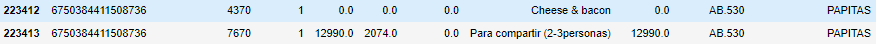

<h3> Despues:</h3>
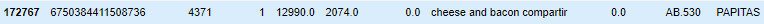
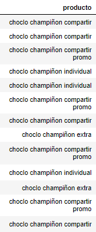

 Para ver mas en detalle como se realizo este trabajo le recomendamos ver el archivo de <a href="/base_de_datos/modificacion_precios.ipynb"><b>modificación de los precios</b></a> y el de <a href="/base_de_datos/productos_actualizados.ipynb"><b>productos actualizados</b></a> que contienen el proceso.

 
<h3><b>🚩 Tarea #1 -</b> Creación de la tabla calendario en Power BI</h3>

Se ha diseñado una tabla en Power BI que despliega la fecha completa de cada registro. Adicionalmente, se han incorporado columnas para representar el mes (tanto en su formato numérico [1-12] como en su forma textual [Enero - Diciembre]), los días de la semana (también en formato numérico [1-31] y en texto [Domingo - Sábado]), y el año correspondiente.
 
Esta estructura resultará fundamental para la creación de segmentadores y la correcta filtración de los datos que el cliente desea visualizar.
Una vez establecido este marco, se inició la distribución de los análisis que debían ser evaluados para la posterior elaboración del panel de control.
 

<h3><b>🚩 Insight #1 -</b> Análisis de Camareros </h3>
El analisis consiste en reunir toda informacion que sume valor al cliente del rendimiento de sus camareros, en este caso se han extraido los siguientes campos:

 

<li>Nombre de todos los camareros registrados</li>
<li>Ingreso total que represento cada empleado</li>
<li>Porcentaje que representan los ingresos por sobre el total de ingresos</li>
<li>Ingresos promedios obtenidos por empleado</li>
<li>Cantidad de ventas</li>
<li>Propinas recibidas</li>
 
A su vez, se hace una segmentacion por meses, donde podemos ver los campos descritos anteriormente pero separados por mes
 
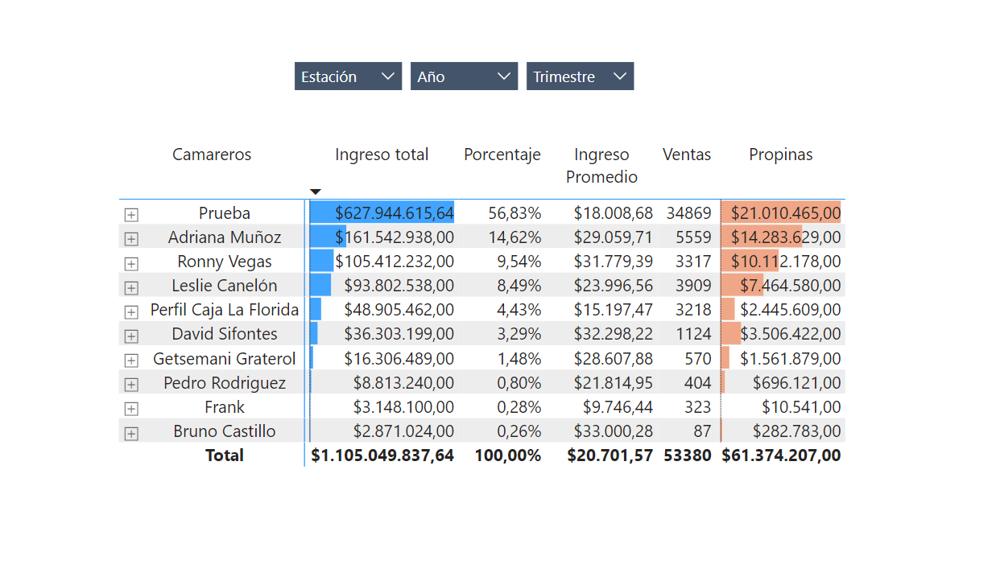
<h3><b>🚩 Insight #2 -</b> Análisis de Ventas </h3>
En el mismo se reuniran los datos mas importantes para medir el rendimiento historico del restaurante, para ello sera necesario
<li>Calcular ingresos totales del cliente</li>
<li>Calcular ventas totales del cliente</li>
<li>Calcular ingresos promedio del cliente</li>

Se debera contar con segmentaciones por:
<li>Año</li>
<li>Trimestre</li>
<li>Estacion</li>

Realizar las visualizaciones que se crean acordes para reflejar la informacion solicitada
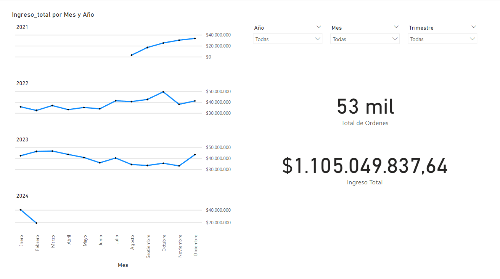
<h3><b>🚩 Insight #3 -</b> Análisis de Ventas por Metodos Online </h3>
El presente tiene como objetivo reunir los datos mas importantes segun los metodos de pago para compras Online, los mismos son:
 
<li>PedidosYa</li>
<li>PedidosYa Efectivo</li>
<li>Rappi</li>
<li>PedidosYa Vouchers</li>
<li>UberEats</li>
<li>Web Pay</li>
<li>Mercat</li>
 
Para los mismos se deben calcular:
 
<li>Ventas totales por metodo</li>
<li>Ingresos totales por metodo</li>
<li>Ingresos promedio por metodos</li>
<li>Porcentaje que represente del total</li>
 
Realizar las visualizaciones que se crean mas adecuadas para la representacion de la informacion
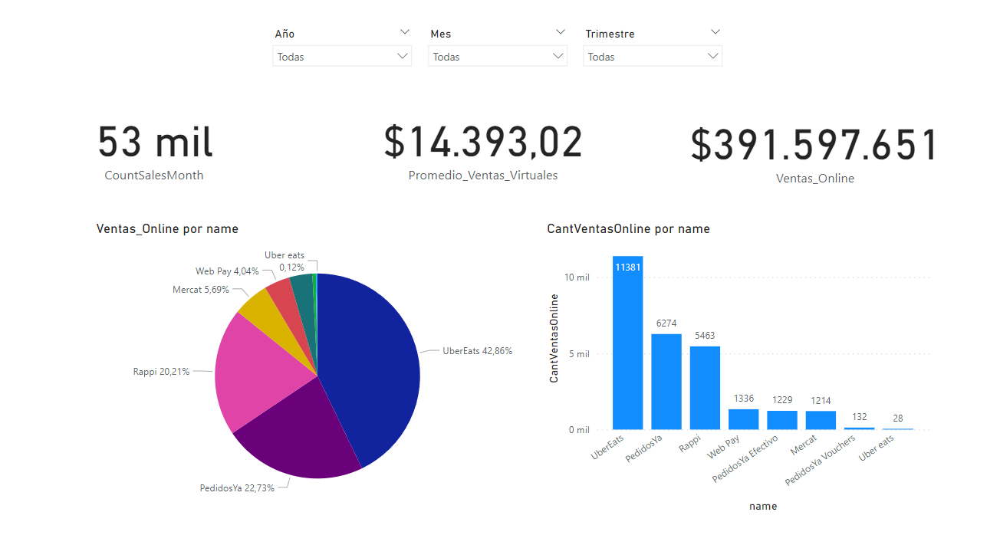
<h3><b>🚩 Insight #4 -</b> Análisis de Ventas por Metodo Local</h3>
El presente tiene como objetivo reunir los datos mas importantes segun los metodos de pago para compras Locales, los mismos son:
 
<li>Efectivo</li>
<li>Tarjeta de Débito</li>
<li>Tarjeta de Crédito</li>
 
Para los mismos se deben calcular:
 
<li>Ventas totales por metodo</li>
<li>Ingresos totales por metodo</li>
<li>Ingresos promedio por metodos</li>
<li>Porcentaje que represente del total</li>
 
Realizar las visualizaciones que se crean mas adecuadas para la representacion de la informacion
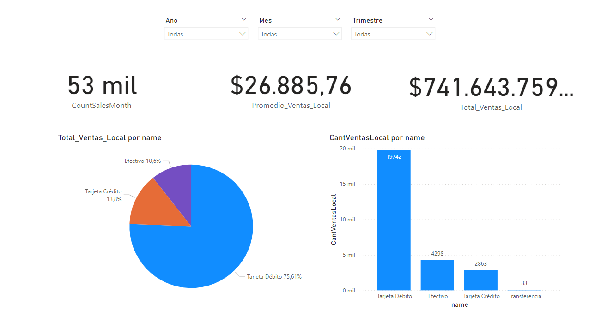

 
<h3><b>🚩 Tarea #2 -</b> Crear Informe de Rendimiento Diario </h3>
 
Crear una pagina nueva para implementar el “Drill trought”, conectado el analisis de los camareros con el informe diario.
 
En este se analizaran profundamente los siguientes campos:
 
<li>Dia con mas ventas</li>
<li>Dia con menos ventas</li>
<li>Horario en el que hay mayor demanda</li>
<li>Horario en el que hay menor demanda</li>
<li>Tabla con el progreso del mes, indicando ingresos obtenidos y ventas concretadas</li>
<li>Segmentador para analizar meses</li>
<li>Grafica para visualizar las ventas e ingresos a lo largo del mes</li>
 
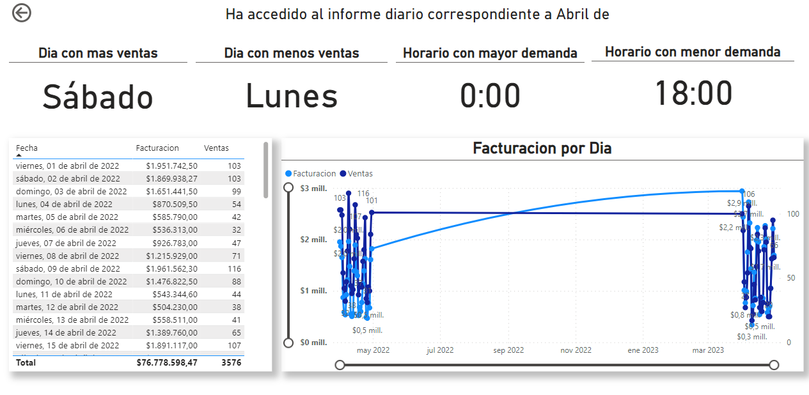

<h3><b>🚩 Tarea #3 -</b> Actualizar Documentación </h3>
Actualizar los registros de documentación de los progresos alcanzados en cada Sprint es esencial. Mantener al día estos registros documentales nos permite un seguimiento detallado de los avances logrados en cada Sprint. Esto posibilita tener un historial claro de las tareas completadas, los obstáculos superados y los resultados obtenidos.

 
<h3><b>🚩 Tarea #4 -</b> Diseño y Desarrollo de Landing Page </h3>
Se solicita la creacion de una Landing Page para presentar de forma mas rapida e intuitiva nuestro producto al cliente
 
Para la misma se necesitara:
 
<li>Crear el diseño desde cero</li>
<li>Definir su paleta de colores</li>
<li>Definir el lenguaje en el cual se codificará [REACT]</li>
<li>Crear el repositorio de la Landing</li>
<li>Instalar la base y las dependencias necesarias para el desarrollo</li>
<li>Construir la pagina web</li>
<li>Corregir los detalles o errores que se presenten</li>
<li>Presentar el prototipo al Equipo</li>
 
El resultado obtenido fue el siguiente:
 
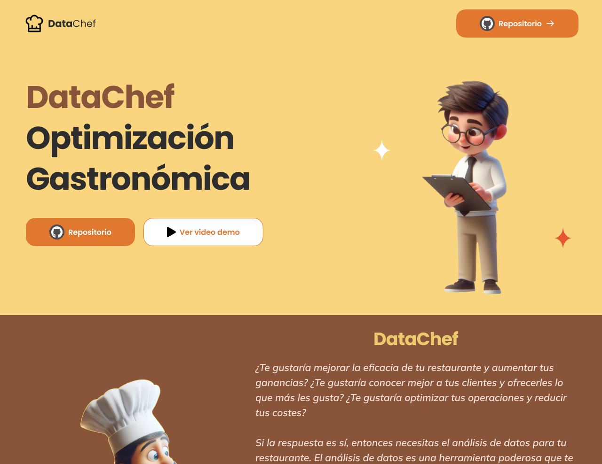
Todos los archivos de nuestra pagina estan en el siguiente <a href="https://github.com/MrForii/c16-95-m-data-bi-landing"><b>Repositorio</b></a>
<h2 align='center' >✅ Sprint 3 ✅ </h2>

<h3><b>🚩 Tarea #5 -</b> Diseño de Portadas para el Dashboard </h3>

Tiene como tarea crear y diseñar las diferentes portadas que van a ser utilizadas en las paginas del Dashboard.
 
Para ello debe:
<li>Respetar la paleta de colores utilizada en la Landing Page</li>
<li>Adaptarse a las diferentes visualizaciones que se han creado</li>

 
Estas portadas fueron diseñadas con la aplicacion de Figma, la misma que fue utilizada para el diseño de la Landing Page, esto nos fue de gran ayuda ya que contabamos con la base de estilos y colores que debian ser usados en las portadas.
 
Se realizaron las portadas para cada una de las paginas que contenia el Dashboard, algunas de ellas quedaron de esta manera:

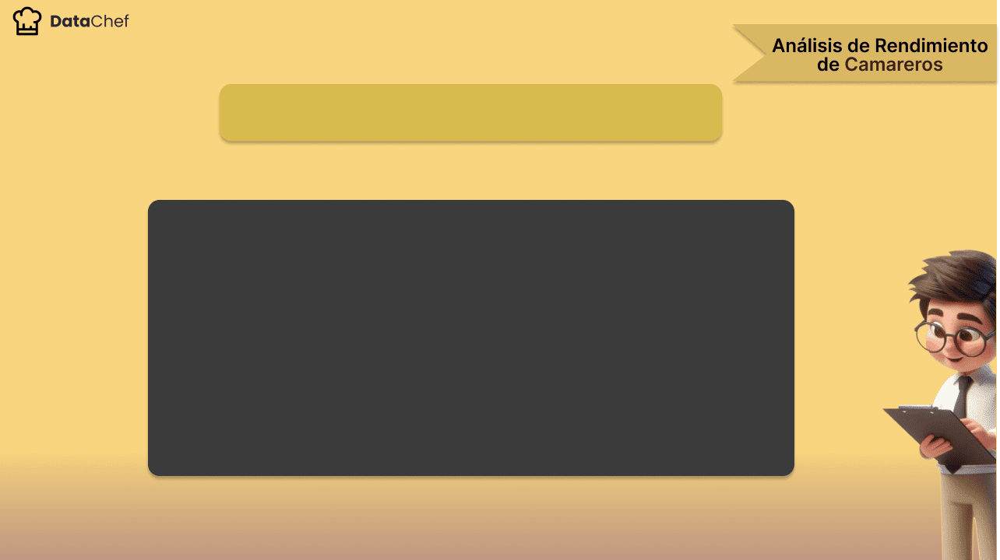

<h3>🚩 Insertar portadas en el Dashboard </h3>
Una vez exportados los diseños se procede a insertar cada fondo en las paginas correspondientes, a su vez, se acomodan las visualizaciones en los espacios ya definidos para una facil y clara comprension de la informacion.
 
Hecho esto el Dashboard quedo de esta manera:

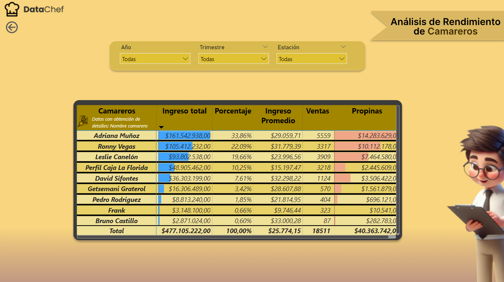

<h3>Reorganizacion de Medidas en Power BI </h3>

En el archivo trabajado se encontraban insertas en el las diferentes medias calculadas que se han utilizado en el desarrollo del proyecto, las mismas estaban una debajo de otra sin organizacion alguna, se opto entonces por la agrupacion en carpetas segun el dato que contuviera cada una de ellas, de esta forma cualquier Analista que quisiera observar nuestro proyecto tendria una mejor comprension de la forma de trabajo utilizada.
 
Se muestra aqui la comparacion de el estado anterior y el actual de las medidas calculadas:

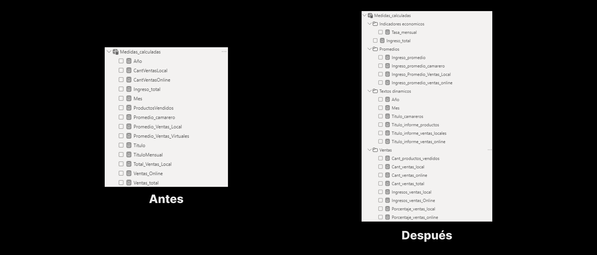

<h3>🚩 Elaboración de Analisis de Series Temporales </h3>

Este fue el proceso seguido para crear un modelo predictivo destinado a estimar las cantidades semanales de productos necesarios para un local comercial. El objetivo es optimizar el inventario basándose en el historial de ventas. A continuación, se describen los pasos principales del proceso:

<li><b>Preparación de Datos:</b> Se genera un dataframe centrado exclusivamente en la fecha y el nombre del producto, derivado de la estructura original de ventas. Las fechas se convierten al formato datetime para facilitar el análisis de series temporales, agrupando los datos por producto y semana para determinar la frecuencia de venta de cada uno.
</li>

<li><b>Limpieza y Filtrado:</b> Se eliminan los productos que no registraron ventas consistentes en el periodo analizado, enfocándose en aquellos con un historial de ventas constante y descartando aquellos con ventas insignificantes o esporádicas.</li>
<li><b>Análisis Exploratorio:</b> Mediante heatmaps, se examina la frecuencia de ventas semanal, identificando los productos más populares y las tendencias estacionales, lo que permite ajustar los parámetros del modelo predictivo para reflejar patrones de compra repetitivos.</li>
<li><b>Modelado Predictivo:</b> Se utiliza el modelo ARIMA, adecuado para datos de series temporales, ajustando el parámetro 'm' para capturar la estacionalidad. El proceso incluye la división de datos en conjuntos de entrenamiento y prueba, y la implementación de un enfoque paso a paso para la predicción semanal.</li>
<li><b>Evaluación del Modelo:</b> Se calcula el RMSE (Error Cuadrático Medio Raíz) para cada producto, proporcionando una medida de la precisión de las predicciones. Los modelos se ajustan individualmente para cada producto, optimizando su capacidad predictiva.</li>
<li><b>Visualización de Resultados:</b> Se presentan gráficos comparativos de las predicciones versus las ventas reales, ofreciendo una visualización clara de la precisión del modelo.</li>

 
Este procedimiento asegura una gestión eficiente del inventario, adaptándose a las variaciones de demanda y optimizando la disponibilidad de productos según las tendencias históricas de venta.
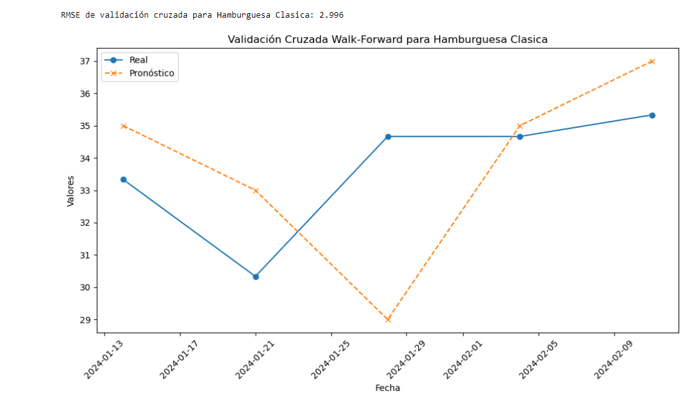
<h4 align="right">Grafica de validacion cruzada para Hamburguesa Clasica</h4>
 
Obtuvimos un modelo predictivo que tiene el siguiente margen de error para cada semana en un tiempo aproximado de un mes. Como los datos reales son hasta febrero, recomendamos hacer predicciones hasta mayo para mayor precisión, ya que al no tener actualización de datos las predicciones hasta más adelante se basan en predicciones anteriores.

 

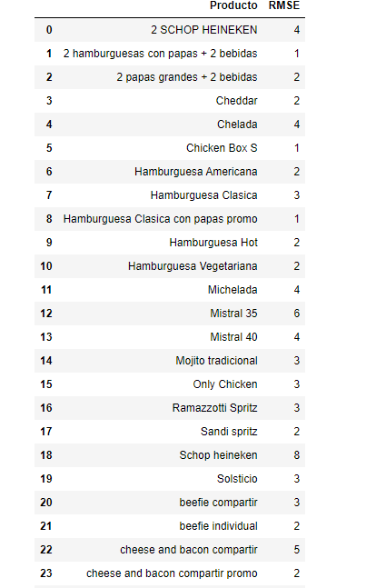

 
 Para ver mas en detalle como se realizo este trabajo le recomendamos ver el <a href="/base_de_datos/Prediccion_productos .ipynb"><b>archivo</b></a> que contiene el proceso.

<h2 align='center' >✅ Sprint 4 ✅ </h2>

<h3>🚩 Diseño de la presentación del DemoDay </h3>

Transitando ya el ultimo sprint de la simulación comenzamos a trabajar en la presentacion final de nuestro proyecto: el DemoDay.

Fuimos organizando toda la informacion que teniamos disponible, separando los puntos claves de nuestro proyecto en una presentación clara y concisa. Los temas que abordamos las slides son: 

<li>¿Porque nace DataChef?</li>
<li>¿Que es DataChef?</li>
<li>¿Que puedo hacer con DataChef?</li>
<li>¿Porque debería implementar DataChef?</li>
<li>Conclusión y próximos pasos</li>

 
 Puedes ver la presentación completa en el siguiente <a href="https://docs.google.com/presentation/d/1MoUGlrZQtjhUjuHmYsH0MJyTQpJ-o4Bo2laxTV-sMyc/edit#slide=id.g2bf9f2a4d85_0_35"><b>link</b></a>

